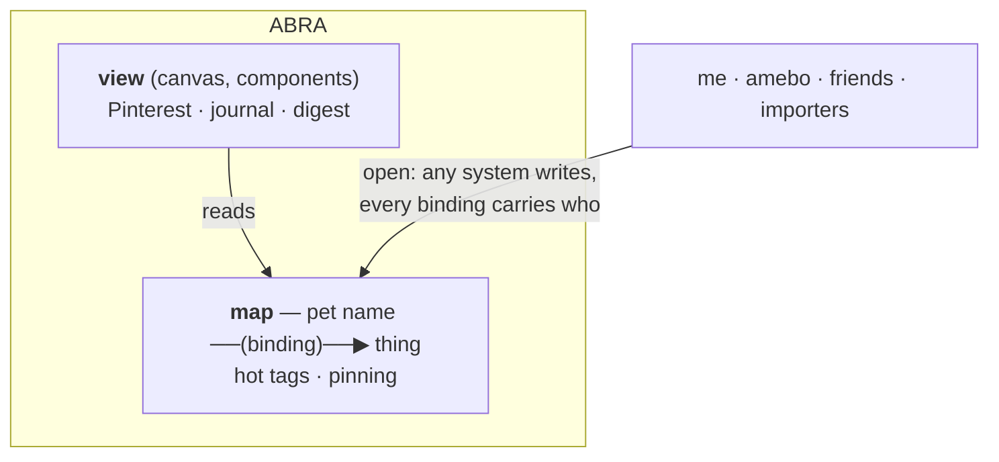

# Abra

A brain extension.

**Names are magic. To name something is to have power over it.**

Abra is the map of what is important to a person, or to a team. Pet names — *peter, ltq1, my son, the Tuesday writing group* — point at things through typed bindings. Hot tags mark what matters right now. Pinning is the emotional marker for permanence.

Abra has two subsystems with a clean boundary inside one repo: the **map** (names, bindings, content, hot tags) and the **view** (canvas + component registry). The view reads the map. The view leans on the map; it is not the map.

Abra holds the map. It does not run loops, take actions, or hold opinions.

Abra is open. Any system can write; every binding carries who wrote it and when. Bindings can optionally be published out as LinkedClaims. The data is durable; implementations are not — *message-in-a-bottle*.

---

## How it works

**Catcodes — coordinates in shared information space.** Every entity can sit at one or more positions in a 64-char positional code tree. Prefix match returns neighbors; relatedness is discovered through proximity. Reserved top-level: `01` Dewey Decimal, `02` Wikidata, `a0` user-defined.

**External systems hold the structured data; abra holds the pointer.** A binding's target can be `crm:odoo/contact/12345` or `tasks:taiga/issue/789` — the CRM holds email and history, the task tracker holds status and due date. Abra holds the pet name and the relationships. Composition, not duplication.

**PII firewall.** PII (email, phone, address) lives in the external system, never in the binding store. Bindings are shareable, exportable, auditable without leaking.

**Permanence axis on every binding.** `INTRINSIC` (definitional, durable) · `CURRENT` (true now, may change) · `EPHEMERAL` (purpose-bound, may expire). The garbage-collection question is answered in the data shape, not in a separate process.

**Multi-writer with provenance.** Any system writes; every binding carries `created_by` and `created_at`. Two systems can disagree; both bindings stay, both visible, both attributable.

Reference implementation runs on Postgres + pgvector. Already holds 4,437 contacts and 11k+ bindings across the `golda` and `linkedtrust` scopes.

---

## Primitives

**Today (in spec + impl):**

| Primitive | Shape | Holds |
|---|---|---|
| Catcode registry | 64-char positional codes, hierarchical, multi-catcode per entity | Positions in spatial information space |
| Scope | Discoverable namespace (`golda`, `linkedtrust`) | Whose map this is |
| Binding | `(name, relationship, target, qualifier, permanence)` | Pet name + typed edge + target |
| Content blob | Text + pgvector embedding | Recorded memory, searchable |
| Hot tag | `(scope, name, priority)` + expiry | What's prominent right now |
| External pointer | URI scheme (`crm:`, `tasks:`) as binding target | Reference into external structured systems |

**Planned:**

| Primitive | Shape | Why |
|---|---|---|
| Provenance | `created_by · created_at` on every binding | Multi-writer attribution. Required. |
| Publish-out marker | Optional link from binding to its LinkedClaim URI | Selective export to the trust web |
| Sources/sinks manifest | `~/.abra/sources.yaml` per scope | What external systems this instance connects to |
| Component registry | Declared in abra (view subsystem) | How the view discovers widgets |

---

## Boundaries

**Owns**
- The map: names, bindings, catcodes, content blobs, hot tags
- Provenance metadata
- The view subsystem (canvas + component registry)
- Read APIs consumed by the view, by amebo, by other agents
- Publish-out path to LinkedClaims

**Doesn't own**
- Loop / agent behavior → **amebo**
- PII → **external CRM**
- Task lifecycle (status, due, assignee) → **external task tracker**
- Mutating text blobs (skills, plans, proposals) → **git repo**
- Trust scoring → **LinkedTrust**
- Conversation threads, event log → **amebo**
- Credentials → **amebo (per org)**

---

## Surfaces

**Inbound** (writers into abra)
- Write binding (provenance required)
- Write content blob (with embedding)
- Set / unset hot tag
- Register catcode

**Outbound** (readers of abra)
- Query: `search · who · about · related · names · refs · when`
- Read for view components
- Publish-out hook (binding → LinkedClaim URI)

**Pointer schemes** (abra points OUT)
- `crm:<provider>/<entity-type>/<id>` (Odoo today, extensible)
- `tasks:<provider>/<entity-type>/<id>` (Taiga today)
- `git:<repo>/<path>` (proposed, for skills/plans/proposals)
- `file:<path>`
- raw URIs

---

**Detail**
- [`concept-notes.md`](concept-notes.md) — vision
- [`arch_notes.md`](arch_notes.md) — architecture
- [`binding-format-v0.1.md`](binding-format-v0.1.md) — data spec
- [`impl/CLAUDE.md`](impl/CLAUDE.md) — reference implementation

**Related systems** (own repos)
- [amebo](https://github.com/Cooperation-org/amebo) — a friendly claw that reads and writes abra
- [LinkedClaims](https://github.com/Cooperation-org/LinkedClaims) — the trust layer abra can publish out to
